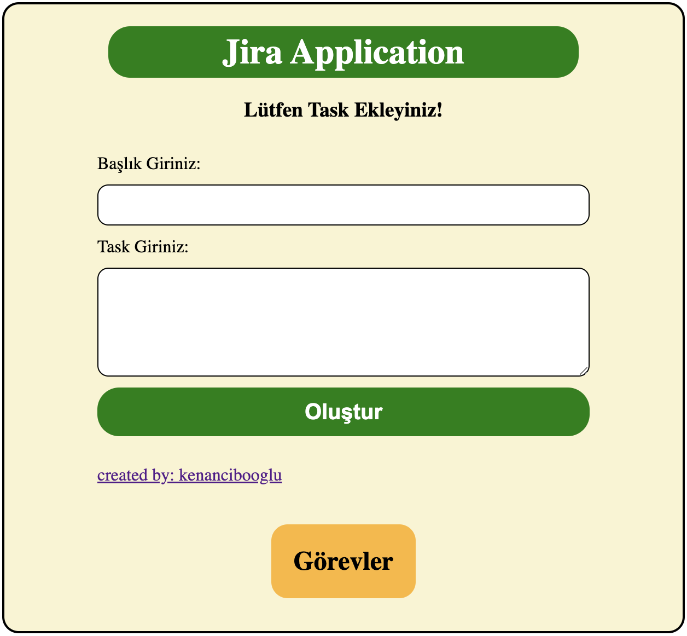

# Jira-Application-with-React

A task and to-do list creation application I created with React.

Bu app ile bir görev atama uygulaması oluşturdum. Görev başlığı ve içeriği bulunacak şekilde yan yana ve alt alta sıralanır.
Sıralanan bu görevleri silebilme ve güncelleyebilme özelliklerine sahibiz.

Bu projede useEffect, useContext, json-server ile backend ve db'e istek atmak için axios kullanılmıştır.

# Author : kenancibooglu
